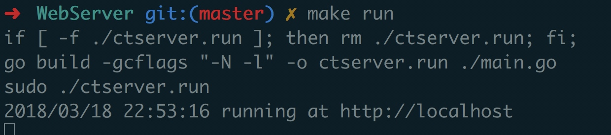
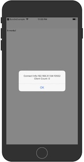

# CTJSBridge

An iOS bridge for sending messages between Obj-C and JavaScript in WKWebView

### Features

- [x] Remote Debug
- [x] Send/Handle Mesasage From Native To JS
- [x] Send/Handle Mesasage From JS To Native

## Play with Demo

- You have to checkout that your mac has installed [golang](https://golang.org/doc/install)

- cd into `CTJSBridge/WebServer` directory and `make run` 



- if you get `listen tcp :80: bind: address already in use
make: *** [run] Error 1` Error. Open then `CTJSBridge/WebServer/main.go` file and change the 80 to other port

- Then `pod update` and run the `CTJSBridge.xcworkspace` project on simulator

- When it is running, you will see the web page, and then tap five times on the screen, the connect info will show up, and the count is 0.



- open Safari and go to `http://localhost`, enter connect info like:`192.168.1.100:58931` to connect to simulator

- close the connect info alert in simulator and tap five times on the screen to show it again, if count is 1, that means the safari has connected to your simulator.


- play it!

- in the real device, you do these step the same, remote debug works on real device either.


## Usage

you don't have to register any object, see js call below:

```javascript
window.CTJSBridge.LoadMethod("Demo", "push", {"key":"value"}, {
        "success":function(result){
          document.getElementById('message').innerHTML = result;
        },
        "fail":function(result){
          document.getElementById('message').innerHTML = result;
        },
        "progress":function(result){
          document.getElementById('message').innerHTML = result;
        },
      });
```

CTJSBridge will alloc the Object named `Target_H5Demo`, and call `Action_push:` with params `{"key":"value"}`.

In the params send to `Action_push:`, you will find three block named `success`,`fail`,`progress`，they received a NSDictionary as callback data to js.

see demo code for more detail:

calling from js: [https://github.com/casatwy/CTJSBridge/blob/master/WebServer/static/index.html](https://github.com/casatwy/CTJSBridge/blob/master/WebServer/static/index.html)

objc receive code: [https://github.com/casatwy/CTJSBridge/blob/master/CTJSBridge/Demo/Targets/Demo/Target_H5Demo.m](https://github.com/casatwy/CTJSBridge/blob/master/CTJSBridge/Demo/Targets/Demo/Target_H5Demo.m)

callback to js: [https://github.com/casatwy/CTJSBridge/blob/master/CTJSBridge/Demo/DemoViewController.m#L47](https://github.com/casatwy/CTJSBridge/blob/master/CTJSBridge/Demo/DemoViewController.m#L47)

#### Cocoapods

pod 'CTJSBridge'

## Requirements

* iOS 8 or higher
* golang

## Authors

* **Casa Taloyum** -  [Casa Taloyum](https://github.com/casatwy)

## Communication

* If you **found a bug**, open an issue.
* If you **have a feature request**, open an issue.
* If you **want to contribute**, submit a pull request.

## License

This project is licensed under the MIT License.

